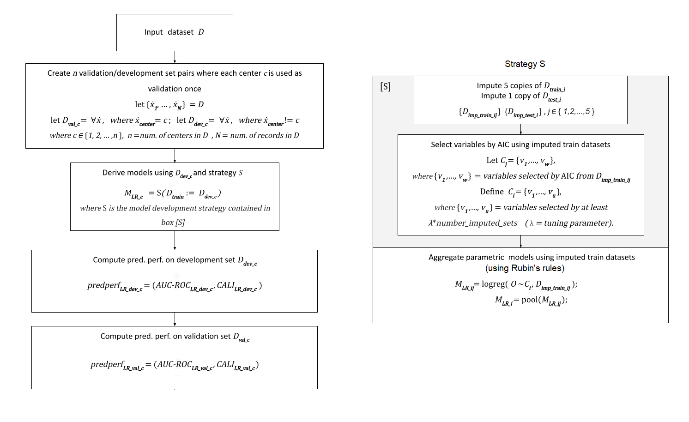

# Leave-Center-Out Analysis (Internal-External Cross-Validation) for multicenter clinical prediction model development strategy validation

# (Implemented in R)

Current supported model types: Logistic Regression

### How to use

1.  Download contents of this repository onto your machine.

2.  Open the files located in the src/ directory in RStudio.

3.  source the 'orchestrator.R' script.

4.  Main function for calling the analysis 'try_perform_leave_center_out_analysis' (located in 'try_LCO.R')

    1.  Open the 'try_LCO.R' script and navigate to the bottom for an example of how to call the function.

5.  Run configuration via 'flags.properties' files

    1.  `MAX_N_CATEGORIES_IN_DATASET` - sets heuristic for how many distinct categories there could be in any given variable of the input dataset (used for determining if a variable is continious or categorical).

    2.  `excluded.predictors` - comma-separated names of variables that should not be used as candidate predictors in the analysis (but may still be used for imputation of missing values).

    3.  `logging.level` - one of `TRACE`, `DEBUG`, `INFO`, `WARN`, `ERROR`, `CRITICAL`.

## Methods

Specifics of the implementation:

-   Imputation of missing values:

    -   dataset is first split into train/test partitions (remaining centers/held out center)

    -   each training partition is imputed 5 times (multiple imputation with 5 copies)

    -   each test partition is imputed once

    -   removes variables with more than 30% missing values

    -   uses `mice` package for impitation

-   Variables selection: stepwise backwards AIC

    -   performed on each imputed training dataset partition

    -   selects variables for model fitting only if they were chosen in all 5 out of 5 imputed training partitions (intresect) (configurable, default 5/5).

